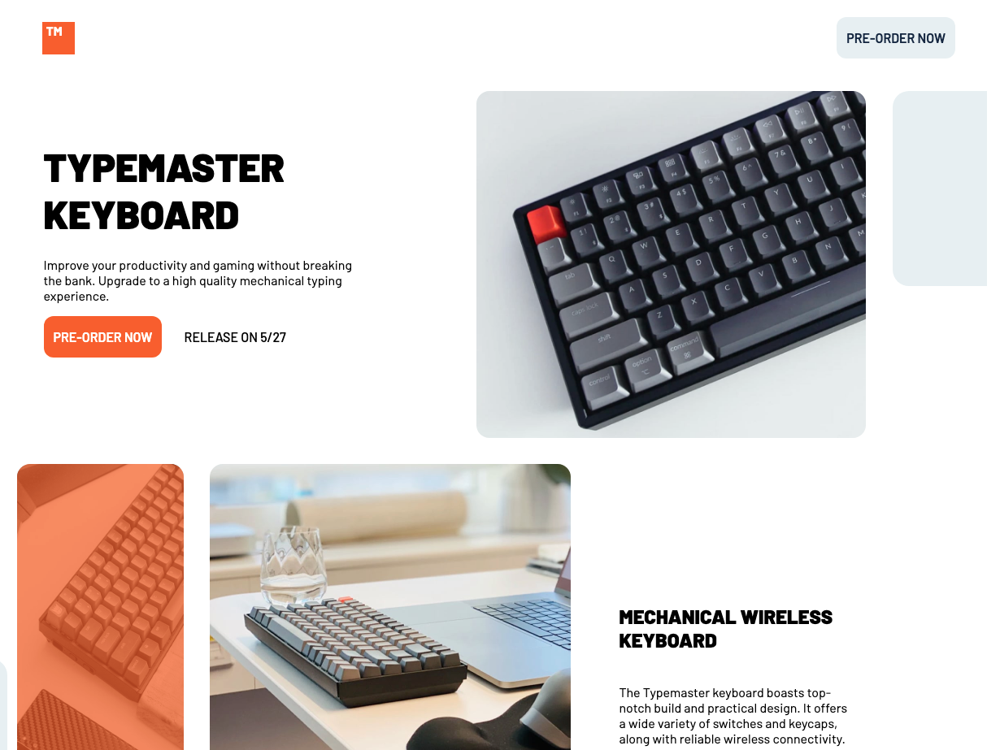

# Frontend Mentor - Typemaster pre-launch landing page

## What I learned

- Tried to use BEM properly for the first time
- Realized that its perfectly fine to have multiple grid containers and mix it up at different viewports
- used more definitive variables in root
- overflow hidden only works on parent
- I should use transform: translate more often then relative positioning
- you cannot use ::before/::after directly on an img element, so the wrapper is required.
- Created an overlay color on an img for the first time
- If a design has multiple photos at multiple viewports insert them in the HTML all at once so I can set the classes right.
- Used active pseudoclass for the first time

